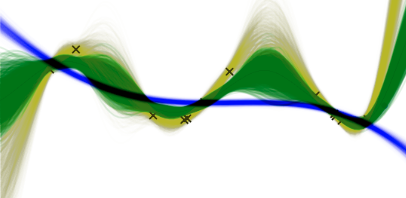

On Wasserstein Gaussian Barycenters
==============================

A project on using Optimal Transport to produce ensembles of Gaussian Processes. The idea is that barycenters produced using the Wasserstein distance possess certain properties that could be useful to practicioners.

